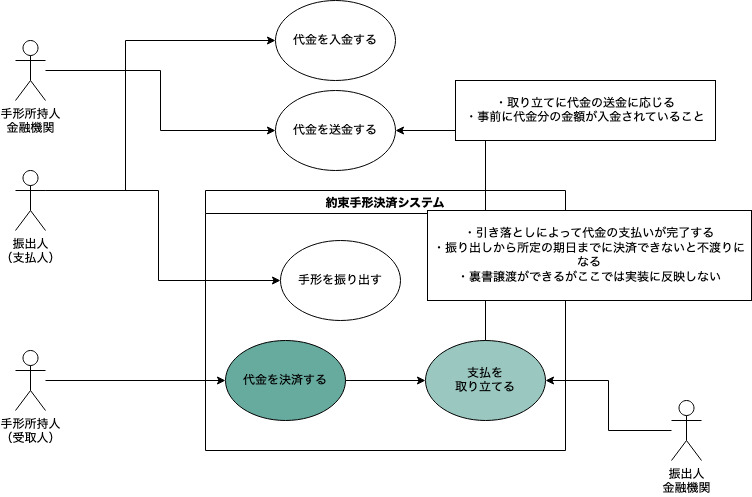

# promissory-notes-platform
約束手形決済プラットフォームアプリ。約束手形を引き受けて、受取人口座に支払いがされるよう決済処理を代行する。

## 約束手形のドメインモデリング
### 約束手形とは
> 振出人が、受取人またはその指図人もしくは手形所持人に対し、一定の期日に一定の金額を支払うことを約束する有価証券のことである。

引用: [約束手形 - Wikipedia](https://ja.wikipedia.org/wiki/%E7%B4%84%E6%9D%9F%E6%89%8B%E5%BD%A2)

約束手形は直接的に取引契約と対応しない無因な有価証券であり、また金融機関を通じて請求・支払・引き落としを行うので厳密には中央決済機関は存在しない。
このアプリケーションは約束手形による決済を仲介するプラットフォームを対象ドメインと見立ててモデリング・実装を試みる。

「約束手形を振り出す」とは代金を支払う振出人が当座預金を持っている銀行に対して取り立てる権利を持つ約束手形の発行を依頼、発行することである。

なおpromissory notesとは約束手形のことである。

### 機能
「振り出された約束手形で決済し、受取人が代金を受け取る」機能が実装される。

### モデリング
1. ユースケース分析

|#|項目|説明|
| ---- | ---- | ---- |
||タイトル|約束手形で代金を決済する|
||アクター|受取人|
||前提条件|振出人によって約束手形が振り出されていること|
||系列|振り出された約束手形を銀行にもっていく<br>取り立てを委任された銀行が振出人銀行に取り立てる<br>振出人当座預金から決済金額引いて受取人銀行に支払<br>受取人銀行は手数料を差し引いて受取人当座預金に引き落としを行う|




2. ドメインモデル


受取人銀行が振出人銀行に対して取り立てを行い、、振出人銀行は口座から金額を差し引いて受取人銀行に支払を行う。
支払を受け取った受取人銀行は手数料を差し引いて受取人当座預金に引き落としを行う。

## 参考
- [約束手形の仕組みとは？小切手との違いやメリット、仕訳方法 | クラウド会計ソフト マネーフォワード](https://biz.moneyforward.com/accounting/basic/45680/)
- [Cheque - Wikipedia](https://en.wikipedia.org/wiki/Cheque)
- [Difference between Promissory note and Cheque under the NI Act - Lawblog4u](https://lawblog4u.in/difference-between-promissory-note-and-cheque/)
- [手形・小切手の振出](https://www.zenginkyo.or.jp/fileadmin/res/education/free_publication/pamph/pamph_04/animal03.pdf)

## 設計
戦略にはドメイン駆動設計を採用する。

### リクエスト・レスポンス
リクエスト
```json
{
  "drawee": {
    "amount": 500000,
    "holder": "藤原道長",
    "bank": "ゆうちょ銀行",
    "branch": "城東店",
    "type": "当座預金",
    "number": "000001"
  },
  "payee": {
    "holder": "中臣鎌足",
    "bank": "ゆうちょ銀行",
    "branch": "本店",
    "type": "当座預金",
    "number": "000002"
  },
  "maturity-at": "2023-05-08",
  "presentation-at": "2023-05-11"
}
```

## 開発

### Setup

When you first clone this repository, run:

```sh
lein duct setup
```

This will create files for local configuration, and prep your system
for the project.

### Environment

To begin developing, start with a REPL.

```sh
lein repl
```

Then load the development environment.

```clojure
user=> (dev)
:loaded
```

Run `go` to prep and initiate the system.

```clojure
dev=> (go)
:duct.server.http.jetty/starting-server {:port 3000}
:initiated
```

By default this creates a web server at <http://localhost:3000>.

When you make changes to your source files, use `reset` to reload any
modified files and reset the server.

```clojure
dev=> (reset)
:reloading (...)
:resumed
```

### Testing

Testing is fastest through the REPL, as you avoid environment startup
time.

```clojure
dev=> (test)
...
```

But you can also run tests through Leiningen.

```sh
lein test
```

## Legal

Copyright © 2022 FIXME
